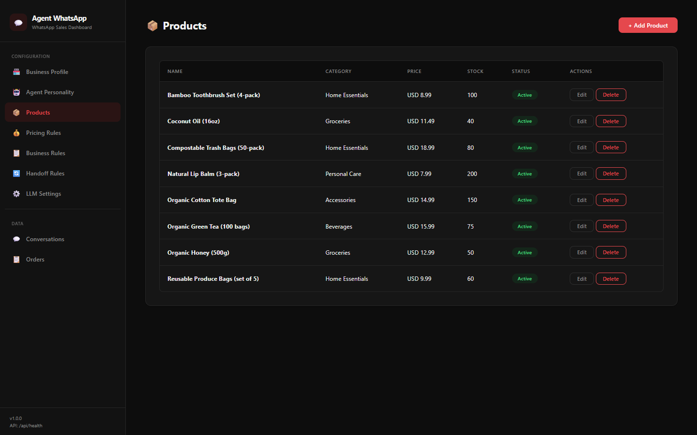
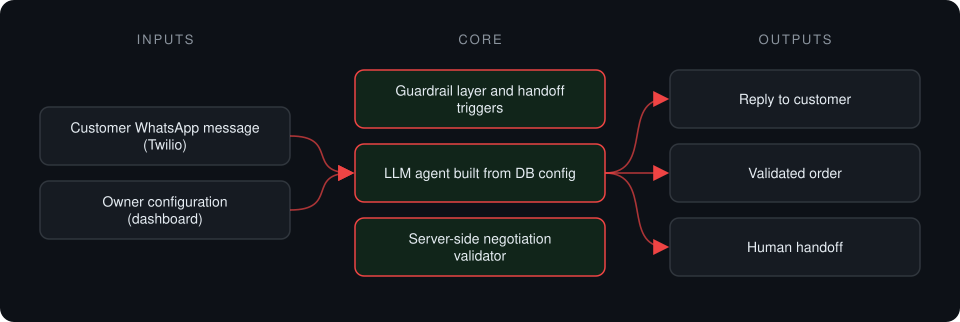
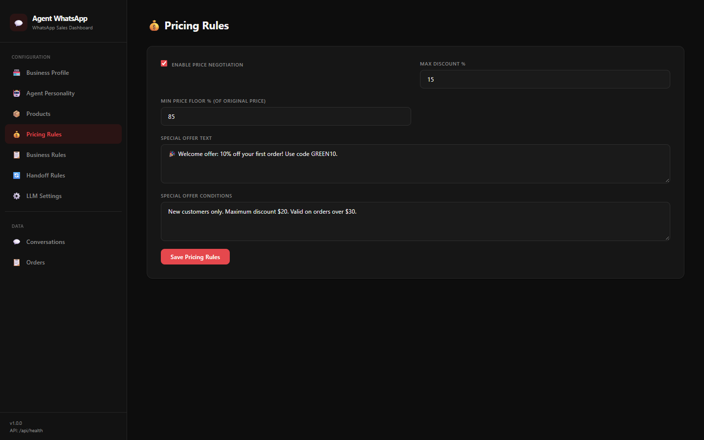

# WhatsApp Sales Agent

**Configurable WhatsApp sales assistant for small shops. The owner sets products, tone, pricing limits and handoff rules in a dashboard, with no redeploys.**

> **This is a proprietary project. Source code is private. This page showcases the system's architecture and results.**

**Case study page:** [https://jryahia.github.io/showcase-whatsapp-sales-agent/](https://jryahia.github.io/showcase-whatsapp-sales-agent/)

## Problem it solves

Small businesses get product and price questions on WhatsApp all day. Hardcoded bots break whenever the catalog or policy changes, and unconstrained ones promise discounts the shop cannot honor. This agent builds its behavior from what the owner configures, and enforces pricing limits on the server.

## Architecture

1. An inbound WhatsApp message arrives through a Twilio webhook.
2. Guardrails check for handoff triggers first. Complaints or explicit requests go straight to a human.
3. Otherwise the agent answers using the business profile, catalog, personality and rules stored in the database.
4. Orders are validated server-side against pricing limits, whatever was said in chat.

## Key features

- Catalog, personality, business rules and handoff rules editable from the dashboard
- Changes apply on the next message, with no redeploy
- Handoff to a human before the LLM is called when a trigger matches
- Pricing floors and discount caps enforced in the backend
- Encrypted provider credentials; DeepSeek or OpenAI

## Tech stack

     

## What it does in practice

- Answers product and pricing questions from live catalog data instead of a fixed script.
- Makes over-promised discounts impossible to turn into orders.

## Screenshots

**Product catalog the agent answers from**

**Pricing rules enforced on every order**

---

Built by [Yahya Jarray](https://github.com/jryahia). Interested in a similar system? [Get in touch](mailto:yahiajarray43@gmail.com).
